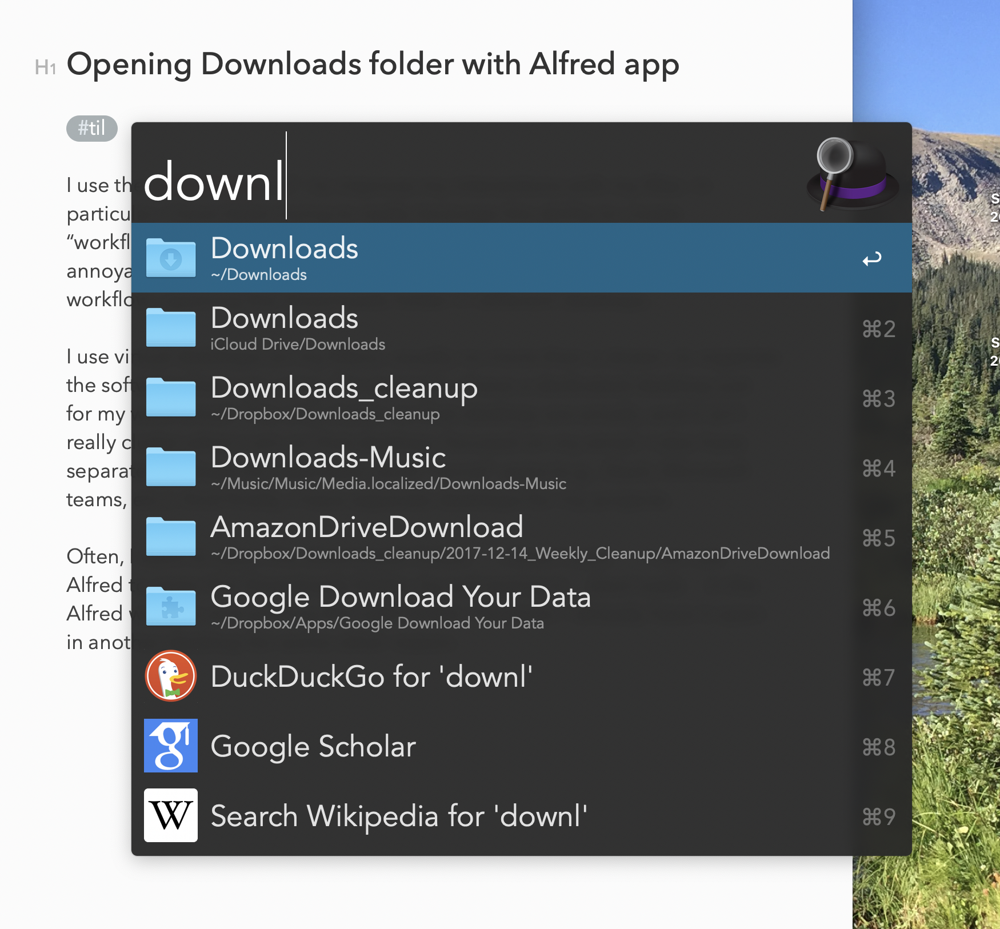
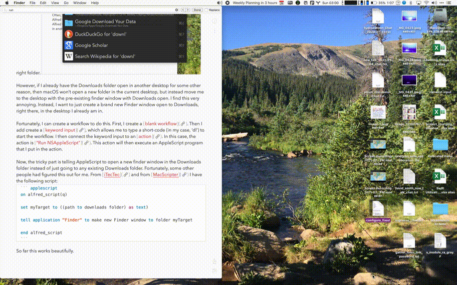

I use the [Alfred App](https://www.alfredapp.com) to improve my interactions with my Mac. In particular, I have been trying to really leverage the ability to create “workflows” in Alfred in order to streamline my work and remove annoyances. One annoyance that I have recently solved with an Alfred workflow: opening the Downloads folder in different desktops.

I use virtual desktops on my Macs, usually no more than a dozen, to organize  the software that I am using. For example, I have a dedicated virtual desktop just for my work email. The only clutter on that virtual desktop are emails, and it isn’t really clutter when I am on that desktop, focused on my email. I also have separate desktops for calendars and work “social” apps (e.g., Slack, Microsoft teams, etc.). And finally, I have separate desktops for my projects.

Often, I want to open the downloads folder, `~/Downloads`.  I can use Alfred to open the Downloads folder, by just typing in `downloads` in the Alfred window and picking the right folder. 



However, if I already have the Downloads folder open in another desktop for some other reason, then macOS won’t open a new folder in the current desktop, but instead move me to the desktop with the pre-existing finder window with Downloads open. I find this very annoying. Instead, I want to just create a brand new Finder window open to Downloads, right there, in the virtual desktop I already am in. 

Fortunately, I can create a workflow to do this. First, I create a [blank workflow](https://www.alfredapp.com/help/workflows/). Then I add a [keyword input](https://www.alfredapp.com/help/workflows/inputs/), which allows me to type a short-code (in my case, ‘dl’) to start the workflow. I then connect the keyword input to an [action](https://www.alfredapp.com/help/workflows/actions/). In this case, the action is [“Run NSAppleScript”](https://www.alfredapp.com/help/workflows/actions/run-nsapplescript/). This action will then execute an AppleScript program that I put in the action. 

Now, the tricky part is telling AppleScript to open a new finder window in the Downloads folder instead of just going to any existing Downloads folder. Fortunately, some other people had figured this out for me. From [iTecTec](https://itectec.com/askdifferent/macos-applescript-how-to-create-a-new-finder-window-for-a-folder-that-is-already-open/) and from [MacScripter](https://macscripter.net/viewtopic.php?id=36300) I have the following script:
```applescript
on alfred_script(q)

set myTarget to ((path to downloads folder) as text)

tell application "Finder" to make new Finder window to folder myTarget

end alfred_script
```

So far this works beautifully.

